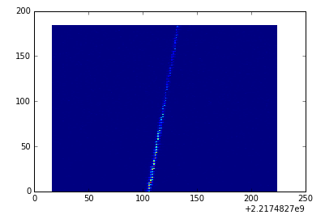
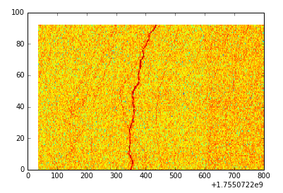

# ML4SETI - BMS

This project contains:

classifiers - Directory where classifiers live. 
data - Directory where data live.
img - Directory where images for the readme live.
processors - Directory where signal processors live.

## Contributing conventions

1. If you are making changes to an existing file, please warn the author.
2. If you are contributing a new file, please begin that file with your name.
3. Please document new files with directions for how to run them.
4. Make your code readable, if we choose it for final iteration, we want to all be able to read it.

## Getting started

Please install all necessary libraries:

```shell

pip install --user --upgrade ibmseti
```

```shell

pip install matplotlib
```

```shell

pip install numpy
```

Run the examples:

```shell
python processors/example_spectrogram.py
```

```shell
python processors/example_processor.py
```

## Project Details

Each night, using the Allen Telescope Array (ATA) in northern California, we scan the sky at 
various radio frequencies, observing star systems with known exoplanets, searching for faint but persistent signals. 
The current signal detection system is programmed to search only for particular kinds of signals: narrow-band 
carrier waves. However, the detection system sometimes triggers on signals that are not narrow-band signals 
(with unknown efficiency) and are also not explicitly-known radio frequency interference (RFI). 
There seems to be various categories of these kinds of events that have been observed in the past. 

Our goal is to classify these accurately in 
real-time. This would allow the signal detection system to make better informed observational decisions, 
increase the efficiency of the nightly scans, and allow for explicit detection of these other signal types. 

The standard approach to SETI signal detection and classification is to transform the observed radio signals, which
are time-series data, into a 
2-dimensional representation called a spectrogram. A spectrogram is a measure of the power of the signal across 
a range of frequencies, as a function of time. From this, our software searches for narrow-band signals. 
One can also think of a spectogram as a 2D image and transform the 
problem into a visual recognition problem. This is likely to be the primary approach for most solutions, 
though other methods are certainly possible. 




But things are never that pretty unless we're looking at a spacecraft. Here's another example: 
a mysterious squiggle observed in 2014 (the color scale is different because the power amplitude, coming out of the
page is on a log-scale). 



 

Similar to the signal above, we often see various signal types that our software is not specifically 
designed to detect. These have various names like "squiggles", "pulsed", and 
"bright pixels".

### The Hackathon & Code Challenge
 
The code challenge will ask participants to build a classification system based on a large body of simulated 
data that we are now constructing. You will receive the raw data for hundreds of thousands of signals, 
like the ones you see above. The most accurate classifier submitted by the end of the code challenge will be installed into the SETI Institute's data analysis pipeline to work on the latest observational data. 